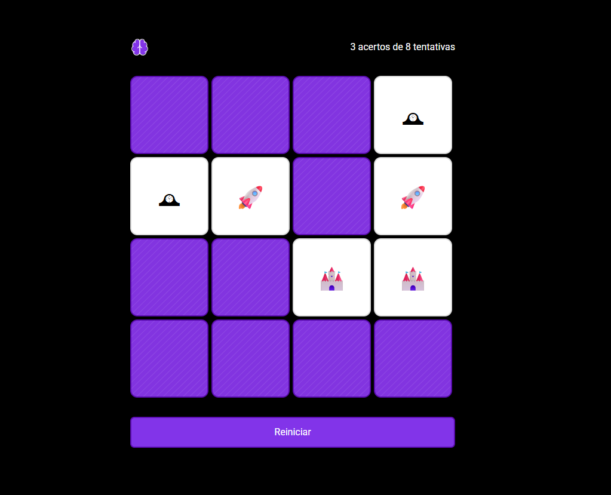

# 🧠 Jogo da Memória

### 🎮 Preview

Bem-vinda(o) ao **Jogo da Memória**, um projeto interativo e divertido criado utilizando apenas **HTML**, **CSS** e **JavaScript** puro. Teste sua memória combinando pares de cartas no menor tempo possível!

🔗 [Acesse o jogo agora no GitHub Pages](https://leo-renno.github.io/memory/)

---

### 🕹 Como jogar
1. Clique nas cartas para revelá-las.
2. Encontre os pares.
3. Tente completar o jogo com o menor número de tentativas possível!

---

### 🚀 Tecnologias Utilizadas

- **HTML5**: estrutura da página.
- **CSS3**: estilos, animações e responsividade.
- **JavaScript (Vanilla)**: lógica do jogo e interações.

---

### 📂 Estrutura do Projeto
- index.html
- styles.css
- scripts.js
- assets/

---

### 📌 Funcionalidades

- 🃏 Cartas com imagens que viram ao serem clicadas.
- 🔁 Reinício rápido do jogo.
- 📱 Design responsivo: jogue em dispositivos móveis ou desktops.
- 🎉 Feedback visual quando todos os pares são encontrados.

---

Desenvolvido por Leonardo Rennó com 💚.
Contribuições, sugestões e feedbacks são bem-vindos!